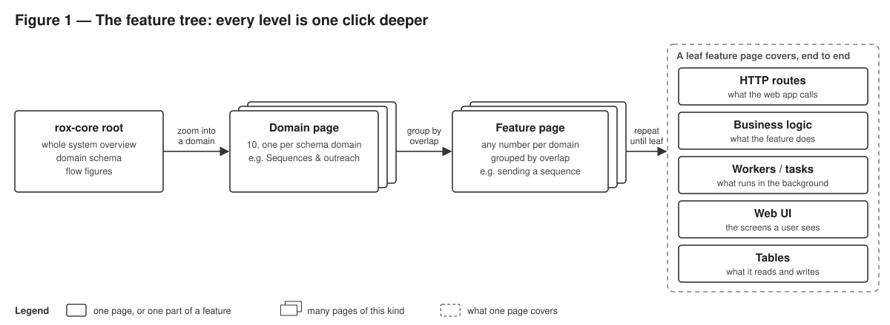
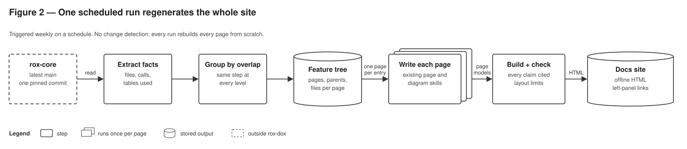

# rox-dox — a feature tree of cited design docs for rox-core, regenerated on a schedule

**Status · 2026-10-01 · planned.** Root page shipped (PRs 8–11); the folder-tree plan is closed in PLAN_deprecated.md. Next: step 1.

## The objective

Marcus can open the rox-core root, click a domain, then a feature, and see that feature end to
end: its routes, logic, background workers, web UI and the tables it reads and writes, with
every box, arrow and sentence cited to rox-core code. One scheduled run rebuilds the whole site
from the latest `main` (SPEC `R-2`, `R-4` to `R-9`; tasks in TASKS.md).

## Constraints

1. **Every element is cited at one pinned commit; an uncited or stale element fails the build.**
   Prevents made-up architecture, the DeepWiki failure the project exists to avoid.
2. **Diagrams already in rox-core's docs are hypotheses until checked against code.** None of
   the seven architecture-doc diagrams was correct as written, and two could not be checked.
3. **Pages are grouped by what the code does, not by folder.** rox-core is split by layer, so a
   folder tree splits one feature across distant pages (`chat/routes/org_chart_v2` vs
   `rox_core/api/org_chart_v2`).
4. **A block figure with more than five layout problems fails the build.** Arrows routed through
   the bottom bundle were unreadable.
5. **Pages are self-contained HTML** that open offline from a local clone.

## Previous steps

| Step | Outcome | What it established |
|---|---|---|
| Root page: overview, domain schema, four checked flow figures | ✅ | Page format, renderers, citation check and diagram skills work · PRs 8–11 |
| Root → chat → leaf as folder pages (old step 1, rest) | ❌ | Removed unrun — superseded by the feature tree |
| Whole repo as a folder tree (old step 2) | ❌ | Removed unrun — folders split features across layers |
| Overlap between sibling folders in `chat` and `chat/routes` | ✅ | Siblings barely overlap; one feature spans distant folders · this session |
| Prior work and brainstorm on parent → child generation | ✅ | Adopted an explicit page tree and full rebuilds; rejected writing parents from children · this session |

## Next steps

1. **Feature map for one domain, Sequences & outreach.** Assign every backend and web file that
   uses the domain's tables, or is called by code that does, to a feature by overlap (shared
   tables plus calls). Output: a reviewable list of features → files → tables, plus the files
   that fit nowhere. *Falsifier:* Marcus judges the groups are not features, or much of the
   domain's code can't be placed. *Cost:* about half a session.
2. **Pages for that domain.** The domain page and each feature page, written with the existing
   page and diagram skills, linked through the left panel. *Falsifier:* Marcus can't tell from a
   feature page what it stores and how it runs, or a spot check contradicts the code. *Cost:*
   about 1 session.
3. **All ten domains plus the scheduled run.** One command regenerates the tree and every page
   at the latest `main`; a weekly schedule runs it. *Falsifier:* an unattended run fails, or
   spot-checked pages are wrong. *Cost:* 1–2 sessions, mostly agent time.

## Decided

- **Feature tree, not folder tree.** Level 1 is the ten schema domains the root already shows;
  the root page stays as it is.
- **One algorithm at every level:** take the page's code, group it by overlap, make each group a
  child page, and repeat on each child until it is a leaf.
- **Overlap decides the number of children; there is no cap.**
- **Page content and diagrams use the existing skills unchanged** (generate-rox-docs,
  block-, schema-, sequence- and state-diagram).
- **Left panel:** table of contents, then the feature tree, then the file Explorer. Clicking a
  folder opens a docs page listing the feature pages that cover its files, never GitHub.
- **Every run rebuilds every page from scratch** at the latest `main` and opens a rox-dox PR
  from a new branch; no change detection yet.
- **Documented files are backend, web, agent skills and deployment config.** Tests and
  migrations are not documented, and the root page says so.
- **Accuracy and readability come before run cost.**
- **No Notion on pages** (SPEC `R-3` retired).
- **Superseded documents are renamed `*_deprecated.md`**, not deleted.

## Out of scope

- Regenerating only changed pages — every run rebuilds everything for now.
- Running on every rox-core PR — there are too many; the schedule is enough.
- Notion context and the right-hand panel — `R-3` retired by Marcus.
- Pages per folder — folders only list the feature pages that cover them.

## Open

- **Where code that touches no table goes** (shims, the agent framework, the LLM client).
  Step 1 shows how much there is; a "Platform" domain at level 1 is the likely answer.
- **The exact overlap measure and when two groups count as one feature.** Tuned in step 1
  against Marcus's review of the groups.
- **When a feature is a leaf.** Decided on the first features in step 2.
- **How web (TypeScript) code joins a feature.** Matching the API routes it calls to backend
  routes; checked in step 1.
- **Code used by many features** (shared models, utilities). Shown on every feature that uses
  it; whether it also gets its own page is decided in step 1.
