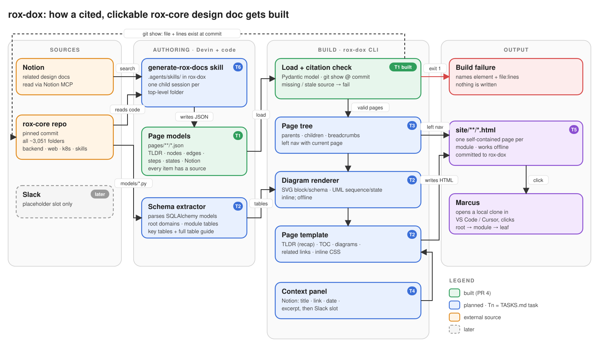

# rox-dox — linked HTML design docs for rox-core, one module deeper per click

**Status · 2026-09-30 · planned.** Sprint tasks approved in TASKS.md; nothing built yet.

## The objective

Marcus can start at the rox-core root page and, by clicking, reach any folder's block, schema,
sequence and state diagrams with every element cited (SPEC R-1 to R-4).

## Constraints

- Diagrams are UML, with a soft limit of about 24 boxes in block diagrams and about 12 elements in sequence and state diagrams. More than that is unreadable, and the CIAO study found generated diagrams to be the weakest output. Schema diagrams are exempt: they show every table the module touches, even 37 or more.
- Facts come from code, and the narrative comes from the model. An uncited element fails the build. DeepWiki-style made-up architecture is the failure this prevents.
- Pages are self-contained HTML (inline SVG and CSS) and open from a local clone.

## Next steps

1. **Generator plus 3 real pages** (root → chat → one leaf); TASKS.md Tasks 1–5. The generator is the page-model JSON, the renderer, the SQLAlchemy schema extractor and the citation check. *Falsifier:* Marcus says the pages don't read like the EvalKit doc, or the citation check can't reject a bad source. *Cost:* about 1 session.
2. **Whole rox-core tree** via the `generate-rox-docs` skill, run as one child session per top-level folder; TASKS.md Task 6. *Falsifier:* spot-checked pages contradict the code. *Cost:* about 1 session, mostly parallel child sessions.

## Decided

- **Model first, then render.** Devin writes a JSON page model (nodes, edges, messages, transitions, each with a source), and a deterministic renderer turns block diagrams into inline SVG, the other diagrams into PlantUML, and the page into HTML. This keeps layout stable between runs and makes R-4 checkable.
- **Schema diagrams come from parsing the SQLAlchemy models in code.** NoSQL stores (Redis, Mongo, OpenSearch, S3) are modelled by Devin, with sources.
- **The page tree covers every folder in rox-core**, including `web/`, `k8s/` and `.agents/skills/`. Folders that are too large or too small are regrouped by dependencies, as in CodeWiki, so the ~3,051 folders stay navigable.
- **PlantUML with Smetana layout for schema, sequence, and state diagrams**, which is pure Java and needs no Graphviz; block diagrams use custom inline SVG.
- **TLDR uses the `recap` format.**
- **Pages are viewed from a local clone** in VS Code or Cursor.
- **The `generate-rox-docs` skill lives in rox-dox under `.agents/skills/`.**
